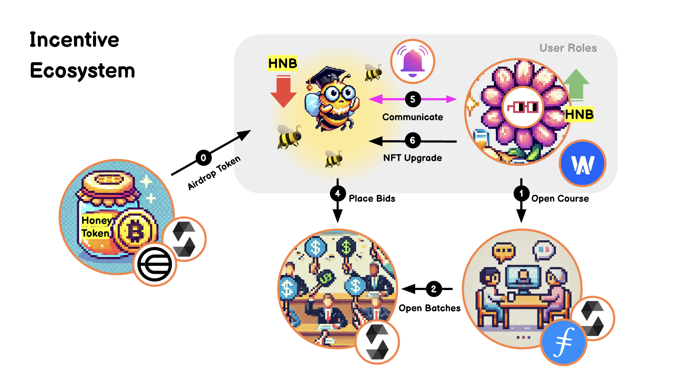

<h1>BeeTutor</h1>

</img>

# Demo Link

- BeeTutor Github: [github.com/BeeTutor](https://github.com/BeeTutor)

- Web Page: [bee-tutor.com](https://bee-tutor.com/)

- Video: [YouTube](https://www.youtube.com/) // TODO

- Contract: // TODO

# Abstract
Imagine you’ve won a bid to have lunch with Warren Buffett—a once-in-a-lifetime opportunity to sit down with one of the world’s most successful investors and pick his brain. This idea isn’t just hypothetical; it’s inspired by the famous Warren Buffett Charity Lunch, where individuals bid millions of dollars for the chance to share a meal and gain invaluable insights from him.
BeeTutor embraces this dual role, aiming to build a bridge where people connect, exchange ideas, and learn from one another, no matter who they are or where they come from.

# What is BeeTutor ?
At BeeTutor, we take this concept and expand it on a much broader scale. We believe that the wisdom worth sharing isn’t limited to icons like Warren Buffett—everyone has valuable and unique experiences that can inspire others. Sometimes, we are the ones who inspire; at other times, we find ourselves inspired.

# Problem Statement
However, we have also discovered that there are several barriers preventing people from sharing effectively.

For sharers,
- High barriers to monetizing knowledge (YouTube 1,000+ subscribers)
- Can’t access seekers across borders
- Challenging to understand one's own market value

For seekers,
- Difficulty in hiring suitable experts across borders
- Hard to access expert ratings and credibility references
- Lack of proof of learning outcomes (recommendation letter)

To address these challenges, we have built an incentive-driven ecosystem designed to eliminate these barriers and create a more seamless sharing experience for everyone.

# How it’s made:
1. **Push Protocol**: Used for communication between users
2. **World - Proof of Human**: Single-Use Airdrop Verification
3. **Web3Auth**: User Authentication
4. **Blockscout**: Verified contracts and monitor blockchain
5. **Protocol Labs - Filecoin**: Course Data and Reviews Storage
6. **Nouns DAO**: Users’ avatar management
7. **Smart Contracts on**
    - Base Sepolia
    - Flow EVM Testnet
    - Linea Sepolia
    - Mantle Sepolia
    - Morph Holesky
    - Rootstock Testnet
    - Scroll Sepolia
    - Zircuit Testnet

# How we do it?
First, our users can log in using (**Web3Auth**). After completing their registration, they can claim their Airdrop with a one-time (**World**) verification.

As sharers, they have the ability to create courses or create badges, and wait for seekers to place bids on their offerings.

On the other hand, as seekers, users can bid on specific sets of badges. Once a seeker wins a bid, they will receive a unique NFT, granting them the right to join a group chat with the sharer.

After winning the bid, seekers can access the group chat through the (**Push Protocol**), with inclusive NFT as entry criteria. In this group chat, they can communicate with the sharer via text messages, video calls, or audio calls, enabling a rich and interactive learning experience.

</img>